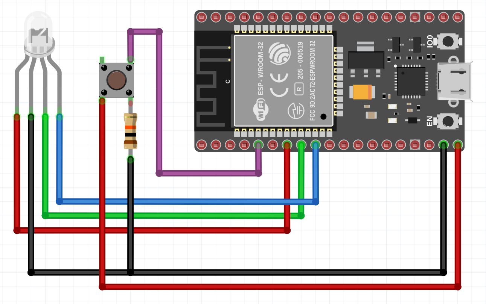

## BLE Connect
With this code it is possible to connect, read and write information in [BLE (Bluetooth Low Energy)](https://en.wikipedia.org/wiki/Bluetooth_Low_Energy) devices. 

> 👉  These codes were implemented for an ESP model ESP32-WROOM-32E

 

     

### ✨ Features 
- Connect to a specific BLE device (MAC address)
- Encrypt and decrypt data with AES128 
- Reading a specific characteristic
- Write in specific characteristic

---

### 🏋️‍♂️ How the example works 

When pressing the push button, ESP32 will connect to the device with the MAC corresponding to the one informed in `pClient->connect(BLEAddress("XX:XX:XX:XX:XX:XX"))`.

After connecting, ESP will attempt to read the characteristic provided in `charUUID`. The information contained in the characteristic is then decrypted with the `serial_number` key and used for the encryption of the command that will be sent to the BLE device.   