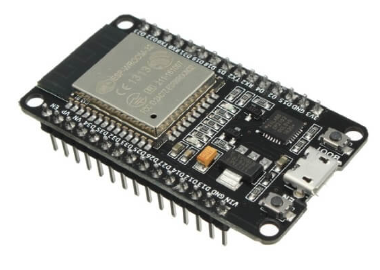

## SmartConfig
The `SmartConfig` is a provisioning technology developed by TI to connect a new Wi-Fi device to a Wi-Fi network. It uses a mobile app to broadcast the network credentials from a smartphone, or a tablet, to an un-provisioned Wi-Fi device.

> 👉  These codes were implemented for an ESP model ESP32-WROOM-32E

 

     

### ✨ Features 
- Perform the configuration and connection of ESP on a Wi-Fi network via the ESPTOUCH App.

### 🏋️‍♂️ How to use this example 

The configuration of the Wi-Fi network in ESP will be carried out by the ESPTOUCH App, available in iOS and Android versions: 
- :robot: [Android source code](https://github.com/EspressifApp/EsptouchForAndroid)
- :apple: [iOS source code](https://github.com/EspressifApp/EsptouchForIOS)

  

### :warning: Important

- It is only possible to perform the configuration and connection on 2.4GHz Wi-Fi networks. 