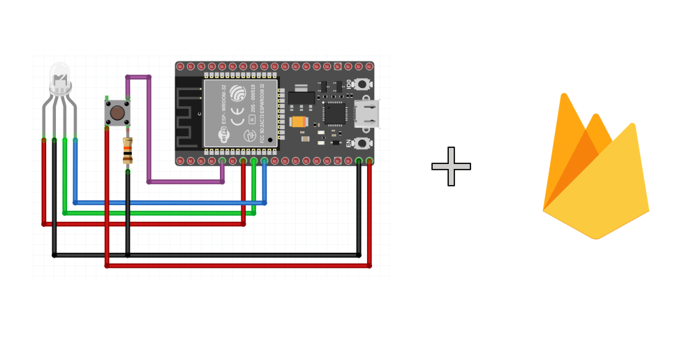

## Stream Callback
This code performs the sending and receiving of information to the [Firebase RTDB](https://firebase.google.com/docs/database) service. 

> 👉  These codes were implemented for an ESP model ESP32-WROOM-32E

 

     

### ✨ Features 
- Table creation in RTDB
- Sending data (counter) to the DB
- LED activation via command sent via RTDB 

### 🏋️‍♂️ How the example works 
On the ESP side, a counter is implemented, incremented through a push button.
Whenever the counter value is changed, ESP sends the new data to RTDB which automatically returns a callback. 

On the RTDB side, whenever the value of the `Led Command` field is changed to "v", "a" or "vm", the corresponding color is activated on the RGB LED. 

- `v`: Green color
- `vm`: Red color
- `a`: Blue color